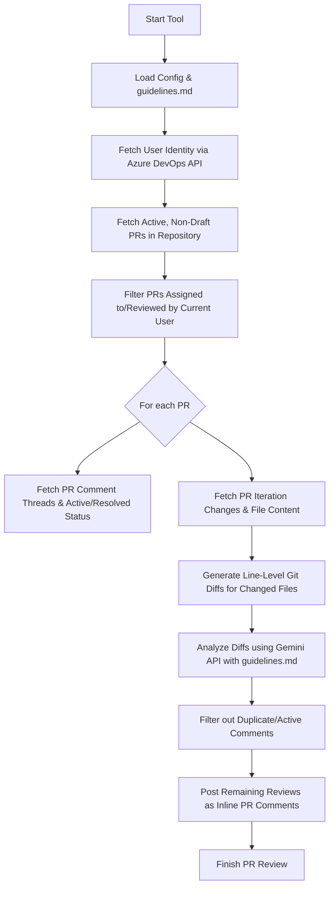

# Azure DevOps PR Review Automation

An automated, AI-powered Pull Request reviewer for Azure DevOps. The tool fetches active, non-draft PRs assigned to the current user, reviews the line-level code changes (diffs) against customizable guidelines defined in a markdown file using the Google Gemini API, and posts precise inline comments. 

It is state-aware and queries existing threads to avoid duplicate comments, and respects resolved threads.

---

## Features

- **Azure DevOps Integration**: Connects via Personal Access Tokens (PAT) to query active PRs and post inline code reviews.
- **Gemini AI Intelligence**: Leverages the official Google Gen AI SDK (`gemini-2.5-flash` or custom models) to review code changes.
- **Customizable Guidelines**: Uses a standard markdown file (`guidelines.md`) to define review rules (readability, security, performance, etc.).
- **Smart Duplicate Prevention**: State-fully checks existing PR threads to skip posting identical advice on the same file and line unless the previous comment was resolved and the issue has recurred.
- **Developer Controls**: Features a "Dry Run" mode to preview AI comments in the terminal before posting them to the PR.
- **Strict Quality Rules**: Codebase is fully structured under TypeScript strict settings, with ESLint quality checks and Prettier formatting standardizations.

---

## Architectural Flow



---

## Directory Structure

```
c:\PR-Automation\
├── package.json            # Run scripts: start, build, test-compile, lint, format
├── tsconfig.json           # Strict TypeScript configuration
├── .eslintrc.json          # ESLint static analysis rules
├── .prettierrc             # Prettier format configurations
├── .env                    # Config parameters (secrets & model types)
├── guidelines.md           # Customizable code review guidelines
├── src/
    ├── index.ts            # Entrypoint (orchestration)
    ├── config/
    │   └── index.ts        # Environment loaders and default constants
    ├── models/
    │   └── types.ts        # Shared interfaces and TypeScript structures
    ├── enums/
    │   └── index.ts        # Application level custom enums
    ├── azure/
    │   ├── client.ts       # Azure client authentication and identity lookup
    │   ├── diff.ts         # Pulls PR files and downloads content streams
    │   └── pr.ts           # Filters active assigned PRs & posts inline comments
    ├── llm/
    │   └── reviewer.ts     # Integrates with Gemini API to review code diffs
    └── utils/
        └── diffHelper.ts   # Computes line-by-line diff patches
```

---

## Installation & Setup

### 1. Prerequisites
- **Node.js** (v18.0 or later)
- **Yarn** package manager

### 2. Install Dependencies
Initialize package installations:
```bash
yarn install
```

### 3. Configure the Environment
Create a `.env` file in the project root and fill in your connection details:
```ini
# Azure DevOps Connection Settings
AZURE_PERSONAL_ACCESS_TOKEN=your_azure_personal_access_token_here
AZURE_ORG_URL=https://dev.azure.com/your_organization_name
AZURE_PROJECT_NAME=your_project_name
AZURE_REPOSITORY_ID=your_repository_id_or_name

# Gemini API Connection Settings
GEMINI_API_KEY=your_gemini_api_key_here
GEMINI_MODEL=gemini-2.5-flash

# PR Review Custom Settings
GUIDELINES_PATH=./guidelines.md
DRY_RUN=false
COMMENT_OFFSET=1
```

> [!IMPORTANT]
> - The Azure DevOps PAT needs **Code (Read & Write)** and **User Profile (Read)** scopes.
> - Retrieve your free Gemini API developer key from [Google AI Studio](https://aistudio.google.com/).

### 4. Customizing Guidelines
Update `guidelines.md` in the root of the project to configure your specific team review checklist rules.

---

## Running the Application

### Execution Commands
- **Run PR Review**: Analyze active, non-draft PRs assigned to you and post inline comments:
  ```bash
  yarn start
  ```
- **Dry Run Mode**: To preview review suggestions in your terminal without posting them to Azure DevOps, set `DRY_RUN=true` in your `.env` file and run:
  ```bash
  yarn start
  ```

### Static Quality Controls
- **Lint Codebase**: Enforces code style and rules using ESLint:
  ```bash
  yarn lint
  ```
- **Format Codebase**: Align layout and spaces using Prettier:
  ```bash
  yarn format
  ```
- **Compile Checks**: Runs TypeScript compiler checks without compiling output:
  ```bash
  yarn test-compile
  ```
