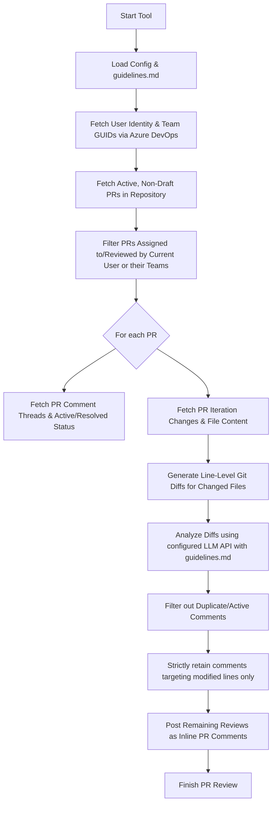

# Azure DevOps PR Review Automation

An automated, AI-powered Pull Request reviewer for Azure DevOps. The tool fetches active, non-draft PRs assigned to the current user (or their team memberships), reviews the line-level code changes (diffs) against customizable guidelines defined in a markdown file using the configured LLM provider, and posts precise inline comments.

It is state-aware and queries existing threads to avoid duplicate comments, and respects resolved threads.

---

## Features

- **Azure DevOps Integration**: Connects via Personal Access Tokens (PAT) to query active PRs and post inline code reviews.
- **Team Assignment Support**: Automatically resolves your Azure DevOps team memberships and reviews PRs assigned to you **or** any of your teams.
- **Multiple LLM Providers**: Built-in, native support for three primary enterprise AI engines:
    - **Google Gemini**: Uses the official `@google/genai` client, with automatic exponential fallback sequences (e.g., falling back from `gemini-2.5-flash` to `gemini-2.0-flash` or `gemini-1.5-flash` if a 503 high-demand spike is encountered).
    - **OpenAI**: Uses the official `openai` SDK to call GPT-4o, GPT-3.5, or custom custom OpenAI-compatible proxies.
    - **Azure OpenAI**: Native enterprise support using deployment instances.
- **Customizable Guidelines**: Uses a standard markdown file (`guidelines.md`) to define review rules (readability, security, performance, etc.).
- **Strict Line-Modification Filtering**: Only evaluates and posts comments on lines that were actually added or modified in the PR. Discards any AI-generated feedback targeting deleted or unchanged surrounding context lines to ensure noise-free code comments.
- **Skip Rejected & Conflicted PRs**: Protects resource consumption by automatically skipping pull requests that have active merge conflicts or have a "Rejected" vote (`-10`) by any reviewer.
- **Smart Duplicate Prevention**: State-fully checks existing PR threads to skip posting identical advice on the same file and line.
- **Developer Controls**: Features a "Dry Run" mode to preview AI comments in the terminal before posting them to the PR.
- **Strict Quality Rules**: Codebase is fully structured under TypeScript strict settings, with ESLint quality checks and Prettier formatting standardizations.

---

## Architectural Flow



---

## Directory Structure

```
c:\PR-Automation\
├── package.json            # Run scripts: start, build, test-compile, lint, format
├── tsconfig.json           # Strict TypeScript configuration
├── .eslintrc.json          # ESLint static analysis rules
├── .prettierrc             # Prettier format configurations
├── .env                    # Config parameters (secrets & model types)
├── guidelines.md           # Customizable code review guidelines
├── src/
    ├── index.ts            # Entrypoint (orchestration)
    ├── config/
    │   └── index.ts        # Environment loaders and default constants
    ├── models/
    │   └── types.ts        # Shared interfaces and TypeScript structures
    ├── enums/
    │   └── index.ts        # Application level custom enums
    ├── azure/
    │   ├── client.ts       # Azure client authentication and identity lookup
    │   ├── diff.ts         # Pulls PR files and downloads content streams
    │   └── pr.ts           # Filters active assigned PRs & posts inline comments
    ├── llm/
    │   └── reviewer.ts     # Integrates with Gemini, OpenAI, or Azure OpenAI
    └── utils/
        └── diffHelper.ts   # Computes line-by-line diff patches
```

---

## Installation & Setup

### 1. Prerequisites

- **Node.js** (v18.0 or later)
- **Yarn** package manager

### 2. Install Dependencies

Initialize package installations:

```bash
yarn install
```

### 3. Configure the Environment

Create a `.env` file in the project root and fill in your connection details:

```ini
# Azure DevOps Connection Settings
AZURE_PERSONAL_ACCESS_TOKEN=your_azure_personal_access_token_here
AZURE_ORG_URL=https://dev.azure.com/your_organization_name
AZURE_PROJECT_NAME=your_project_name
AZURE_REPOSITORY_ID=your_repository_id_or_name

# Active LLM Provider Configuration
# Options: gemini | openai | azure-openai
LLM_PROVIDER=gemini

# Google Gemini Settings (Required if LLM_PROVIDER=gemini)
GEMINI_API_KEY=your_gemini_api_key_here
GEMINI_MODEL=gemini-2.5-flash

# OpenAI Settings (Required if LLM_PROVIDER=openai)
OPENAI_API_KEY=your_openai_api_key_here
OPENAI_MODEL=gpt-4o

# Azure OpenAI Settings (Required if LLM_PROVIDER=azure-openai)
AZURE_OPENAI_API_KEY=your_azure_api_key_here
AZURE_OPENAI_ENDPOINT=https://your-resource.openai.azure.com/
AZURE_OPENAI_DEPLOYMENT=your-deployment-name
AZURE_OPENAI_API_VERSION=2024-05-01-preview

# PR Review Custom Settings
GUIDELINES_PATH=./guidelines.md
DRY_RUN=false
COMMENT_OFFSET=1
```

> [!IMPORTANT]
>
> - The Azure DevOps PAT needs **Code (Read & Write)** and **User Profile (Read)** scopes.
> - Required variables in the `.env` are checked **conditionally** based on your active `LLM_PROVIDER`, so you don't need to specify credentials for unused providers!

### 4. Customizing Guidelines

Update `guidelines.md` in the root of the project to configure your specific team review checklist rules.

---

## Running the Application

### Execution Commands

- **Run PR Review**: Analyze active, non-draft PRs assigned to you or your teams, and post inline comments:
    ```bash
    yarn start
    ```
- **Dry Run Mode**: To preview review suggestions in your terminal without posting them to Azure DevOps, set `DRY_RUN=true` in your `.env` file and run:
    ```bash
    yarn start
    ```

### Static Quality Controls

- **Lint Codebase**: Enforces code style and rules using ESLint:
    ```bash
    yarn lint
    ```
- **Format Codebase**: Align layout and spaces using Prettier:
    ```bash
    yarn format
    ```
- **Compile Checks**: Runs TypeScript compiler checks without compiling output:
    ```bash
    yarn test-compile
    ```
