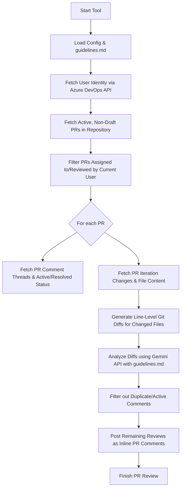

# Azure DevOps PR Review Automation - Implementation Plan

This document outlines the architecture, components, and steps to build a TypeScript-based command-line tool that automates the PR review process in Azure DevOps. The tool identifies active, non-draft PRs assigned to the current user, reviews the changes against standard guidelines written in markdown, and posts line-level review comments while ensuring resolved threads are respected and duplicates are prevented.

## Architecture & Flow

The system runs as a CLI command or inside an automated CI/CD environment:



---

## Proposed Changes

We will initialize a clean, modern TypeScript project in `c:\PR-Automation` using a modular architecture:

```
c:\PR-Automation\
├── package.json
├── tsconfig.json
├── .env
├── guidelines.md
├── src/
│   ├── index.ts                # Application Entry Point (CLI)
│   ├── config.ts               # Configuration and Environment variable loader
│   ├── azure/
│   │   ├── client.ts           # Azure DevOps API client initialization
│   │   ├── pr.ts               # PR retrieval, filtering, and comment posting
│   │   └── diff.ts             # File retrieval and diff generation utilities
│   ├── llm/
│   │   └── reviewer.ts         # Gemini API integration and review formatting
│   └── utils/
│       └── diffHelper.ts       # Text diffing helper
```

### 1. Root Configuration & Project Files

#### [package.json](file:///c:/PR-Automation/package.json)
Contains project dependencies:
- `@google/genai` (Official Google Gemini SDK)
- `azure-devops-node-api` (Official Microsoft Azure DevOps Node Client)
- `dotenv` (Environment variable loading)
- `diff` (For computing line-by-line diffs)
- `typescript`, `@types/node`, `ts-node` (For TS compilation and run)

#### [tsconfig.json](file:///c:/PR-Automation/tsconfig.json)
Configures TypeScript with standard strict configurations, targeting ES2022 or Node 18+.

#### [guidelines.md](file:///c:/PR-Automation/guidelines.md)
A sample guidelines document outlining review checks.

#### [.env](file:///c:/PR-Automation/.env)
Stores secrets and config variables:
```ini
AZURE_PERSONAL_ACCESS_TOKEN=your_pat_here
AZURE_ORG_URL=https://dev.azure.com/your_org
AZURE_PROJECT_NAME=your_project
AZURE_REPOSITORY_ID=your_repo_id_or_name
GEMINI_API_KEY=your_gemini_api_key_here
GUIDELINES_PATH=./guidelines.md
```

---

### 2. Implementation Modules

#### [config.ts](file:///c:/PR-Automation/src/config.ts)
Validates and parses environment variables.

#### [client.ts](file:///c:/PR-Automation/src/azure/client.ts)
Initializes connection to Azure DevOps GitApi and CoreApi using the PAT.

#### [pr.ts](file:///c:/PR-Automation/src/azure/pr.ts)
- Resolves the identity of the current user associated with the PAT.
- Fetches all active, non-draft PRs.
- Filters PRs where the current user is in the `reviewers` list.
- Fetches PR threads (active comments and their status: resolved, pending, active) and filters them.
- Posts inline comments using `createThread` with appropriate `PullRequestCommentThread` properties specifying the position (file, line number, offset).

#### [diff.ts](file:///c:/PR-Automation/src/azure/diff.ts) & [diffHelper.ts](file:///c:/PR-Automation/src/utils/diffHelper.ts)
- Fetches iteration changes for the latest PR iteration.
- Downloads source and target file contents.
- Computes line-by-line diffs, tracking original and modified line numbers, so that reviews can be correctly mapped back to the PR line numbers.

#### [reviewer.ts](file:///c:/PR-Automation/src/llm/reviewer.ts)
- Connects to the Gemini model using `@google/genai`.
- Construct a robust system prompt that passes the markdown guidelines and the diff of changed files.
- Formats the prompt to output inline review suggestions as a structured JSON object:
  ```json
  [
    {
      "filePath": "src/index.ts",
      "line": 42,
      "comment": "..."
    }
  ]
  ```
- Parses the Gemini response and feeds it back to the PR module.

#### [index.ts](file:///c:/PR-Automation/src/index.ts)
Orchestrates the entire review flow:
1. Fetch PRs assigned to user.
2. For each PR:
   - Fetch changes.
   - Run LLM reviewer.
   - Fetch existing comment threads.
   - Compare and filter out duplicate active threads.
   - Post new reviews.

---

## Verification Plan

### Automated Tests
- We will construct unit tests and run a compilation/build check using TypeScript compiler:
  ```bash
  npx tsc --noEmit
  ```
- Run the tool in dry-run mode (logging changes without posting) before running live reviews.

### Manual Verification
- Deploy a test PR on Azure DevOps.
- Run the tool locally using `npx ts-node src/index.ts`.
- Verify comments are posted correctly.
- Mark one comment as Resolved and leave another Active. Run the tool again and verify:
  - Active comment is **not** duplicated.
  - Resolved comment is **not** duplicated if the issue is gone, but can be reposted elsewhere if needed.
